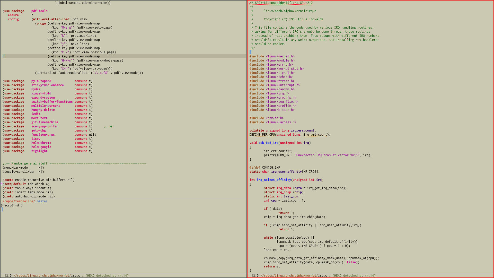
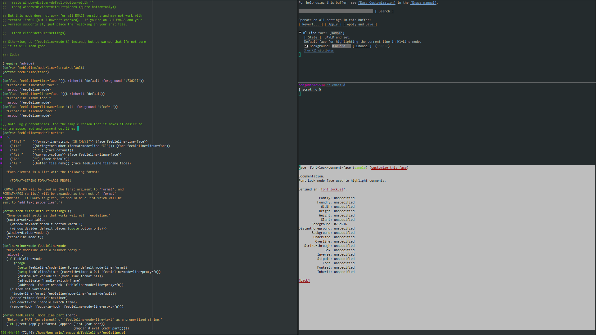
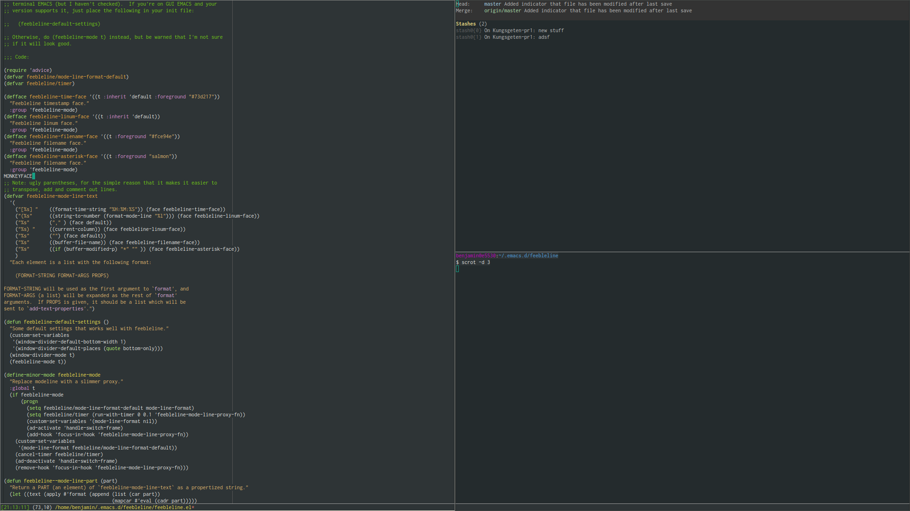

# feebleline
For hardline Luddite editing!

Feebleline removes the modeline and replaces it with a slimmer proxy
version, which displays some basic information in the echo area
instead.  This information is only displayed if the echo area is not used
for anything else (but if you switch frame/window, it will replace whatever
message is currently displayed).

The modeline gets restored when you toggle off feebleline-mode, of course.

## Note on new version

I apologize in advance to anyone who updated the package from melpa and got
something completely different than what they used to get. The work-around if
you miss the old version is to uninstall feebleline, clone this repo, checkout

    89ddf31ecad885e5491e8d6b71b48c1591b3faec

and keep using the old version. But I have no idea why anyone would want to.

## Customizations
There are some customizations available, check out

    customize-group feebleline

to see what you can do. An example init snippet would look something like:

    (use-package    feebleline
      :ensure       t
      :config       (setq feebleline-msg-functions
                          '((feebleline-line-number         :post "" :fmt "%5s")
                            (feebleline-column-number       :pre ":" :fmt "%-2s")
                            (feebleline-file-directory      :face feebleline-dir-face :post "")
                            (feebleline-file-or-buffer-name :face font-lock-keyword-face :post "")
                            (feebleline-file-modified-star  :face font-lock-warning-face :post "")
                            (feebleline-git-branch          :face feebleline-git-face :pre " : ")
                            (feebleline-project-name        :align right)))
                    (feebleline-mode 1))

The minibuffer should now show something similar to:

        1:0  ~/feebleline/feebleline.el : development                                                feebleline

## Screenshots
This is a screenshow from the latest version (yes that is my
actual ugly day-to-day theme):

### Outdated scrots

(but on less ugly theme :P)

How it looks when the file has been modified:

